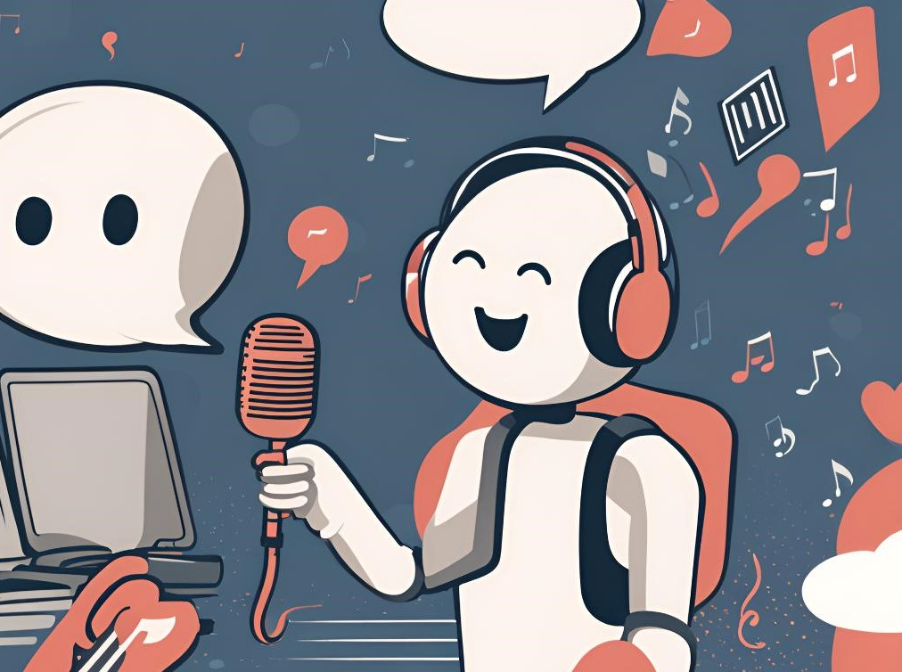

# LyricChat
Aims to create an AI chatbot that emulates the unique lyrical style and tone of specific musical artists

# Scripts (src)

## lyric_scrapping

A python OOP function that scrape lyrics data from Genius.com. You need to apply for a genius API key before using this app. The scrapped output is saved at `data/lyrics` in json format

**Tools**
- scrapping: API endpoints [from genius.com](https://docs.genius.com/) ([Term of service](https://genius.com/static/terms))

## emotion_feature_extraction

A python OOP function that utilize LLM to do sentiment analysis and add metadata to the lyric database

**Tools**
- Prompt formatting: Microsoft guidance
- LLM: llama.cpp

## rag

A python OOP function that retrieves song lyrics and recommend songs based on the user's emotion

**Tools**
- Prompt engineering: CoT, few shots
- Database: Qdrant
- LLM: Ollama, Langchain