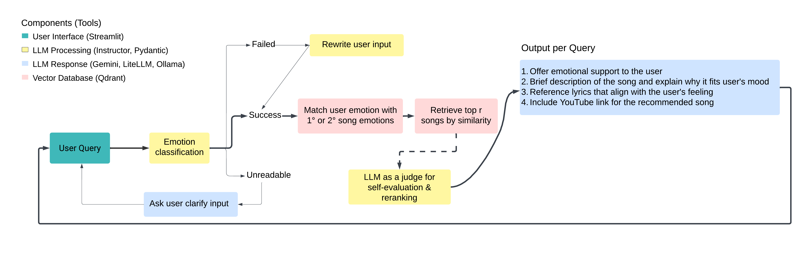

# LyricChat: Turn feelings into melody 🎼

* **Short-term goal**: create an AI chatbot that connects with users emotionally and recommends a song that matches their current mood.

* **Ultimate goal**: provide a comforting companion for people who need someone to talk to, helping them de-stress while enjoying good music.

* [**Try it out!**](https://lyricchat001.streamlit.app/): Check out LyricChat and see how it matches songs to your mood.

* [**Got Feedback?**](https://forms.gle/8UdjnPAEX3emiLCu8): Let us know what you think or how we can make it better!

### ChatBot workflow

### Demo video
* version: 0.0.1

https://github.com/user-attachments/assets/6bb6dba7-4307-446f-ae1f-1eb82de9bbd4

# Environment

* [Docker composed file](docker/docker-compose.yaml): For local deployment of the app

* [requirements.txt](requirements.txt): Lists all dependencies for the Streamlit app

# Scripts Overview

If you're interested in the backend database, check out the [LyricChatDB repository](https://github.com/tctsung/LyricChatDB.git) for more details.

| File         | Description                                                                 |
|---------------------|-----------------------------------------------------------------------------|
| `main.py`           | Streamlit-based UI interface; supports Traditional Chinese and English.    |
| `src/llm.py`        | Combines Instructor-structured LLM package and LiteLLM for an unified interface across multiple LLM providers |
| `src/rag.py`        | Implements LLM workflow with custom prompt templates, emotion classifier, and advanced RAG for song recommendations. |
| `src/qdrant_db.py`  | Custom interface for CRUD operations on the LyricChat vector database using Qdrant. |

---
Future work:
* Don't force the user express feelings. The main goal is to help user, not recommend songs
* Reranking for vector DB query
* Self-evaluation 
