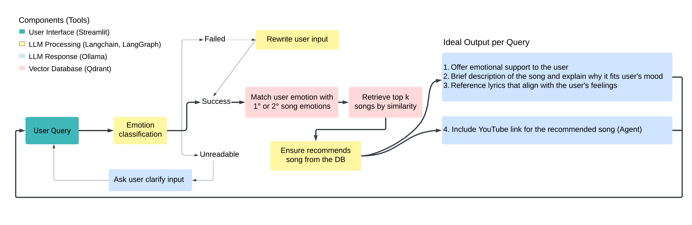

# LyricChat Overview            
Aims to create an AI chatbot that connects with users emotionally and recommends a song that matches their current mood.

### ChatBot workflow

### Demo video

* version: 0.1.0

https://github.com/user-attachments/assets/43a7fd44-5a54-4fc2-bce6-8e726cc33ea3

# Environment

## Docker

* To be constructed

* Will have two docker-compose.yaml file in the future, one for building the database, and the other one for running the chatbot with UI interface

## Venv

* Each folder contains it's own requirement.txt file except `app/`, which shares the same requirements file as `rag/`

# Scripts

## src\lyric_scrapping\scrape.py

**LyricScraper**

A Python OOP function that scrapes, preprocesses, and filters lyrics data from Genius.com. The function removes songs with invalid titles (e.g., remixes), insufficient word counts (default: fewer than 30 words), or high similarity to other songs (default: similarity ratio > 0.6 based on the Longest Contiguous Subsequence (LCS) algorithm). For more details, refer to each directory in `data\genius\artist_timestamp\LyricScraper.meta`.

* **Note:** You need to apply for a [genius API key](https://docs.genius.com/) from genius.com before using this app ([Term of service](https://genius.com/static/terms))

## src\emotion_feature_extraction\extract.py

**EmotionExtractor**

This Python OOP function adds metadata to the lyrics database, enhancing the quality of advanced RAG pre-retrieval through metadata filtering. The metadata includes sentiments, emotions, and themes (represented by three keywords). I use the `Microsoft guidance` prompt engineering framework instead of Langchain in the RAG app to enforce stricter LLM output, such as categorical variables, and apply regex for keyword extraction.

* **Input**: Data is sourced from the JSON output of `src\lyric_scrapping\scrape.py`.
* **Output**: The processed files are saved in the same directory as the provided input. See `EmotionExtractor.meta` within each `data\genius\artist_timestamp\` folder.

* Future work: Implement GPU support for llama.cpp

## src\rag\rag.py

**CreateDB**

A Python OOP class designed for creating a Qdrant vector database. This class adds the latest scraped data for each artist from the `data\genius\` directory into the vector database. Each JSON file is first transformed into Langchain Documents (where each document represents a song) and then added to a Qdrant collection.

* **Note**: Ensure that a Qdrant Database client (e.g., Docker container) is initiated before running this class.

**LyricRAG**

A Python OOP class equipped with multiple methods and prompt templates for handling LLM processing.

*Prompts*

This class contains all the prompts used in the workflow as class attributes. Chain-of-thoughts, format instructions, and few shots techniques are implemented

*Implemented Chains*

Each method creates a different chain as an attribute within the class:

* **`create_rag_basic`**: Initializes a basic RAG chain without memory.
  * Chain Name: `LyricRAG.rag_chain_basic`

* **`create_rag_conversation`**: Sets up a conversational RAG chain with a default memory of the past two conversations.
  * Chain Name: `LyricRAG.rag_chain_conversation`
  * Note: Utilizes `create_customized_retriever()` to implement metadata filtering.

* **`create_sentiment_chain`**: Builds a chain for emotion and sentiment classification.
  * Chain Name: `LyricRAG.sentiment_chain`

*Query Methods*

Each method returns the LLM output as a string

* **`simple_query`**: Executes a basic query with no RAG, using a custom prompt template.
* **`rewrite_user_input`**: Rewrites user input while maintaining the original emotional tone.
* **`sentiment_analysis`**: Performs emotion classification using `LyricRAG.sentiment_chain`.
* **`naive_rag`**: Executes a basic RAG query with `LyricRAG.rag_chain_basic`
* **`advanced_rag`**: Executes an advanced RAG query with metadata filtering using `LyricRAG.rag_chain_conversation` (Future plans include adding a small-to-big retrieval process.)

## src\app\webpage.py

A Python script for launching the Streamlit UI interface. Start the interface using `streamlit run src/app/webpage.py`. Ensure that both the Ollama and Qdrant servers are running before starting the interface. Chat history will be automatically saved in the `data/chat_history` directory. Users can filter recommended songs by artist through the dropdown menu.
